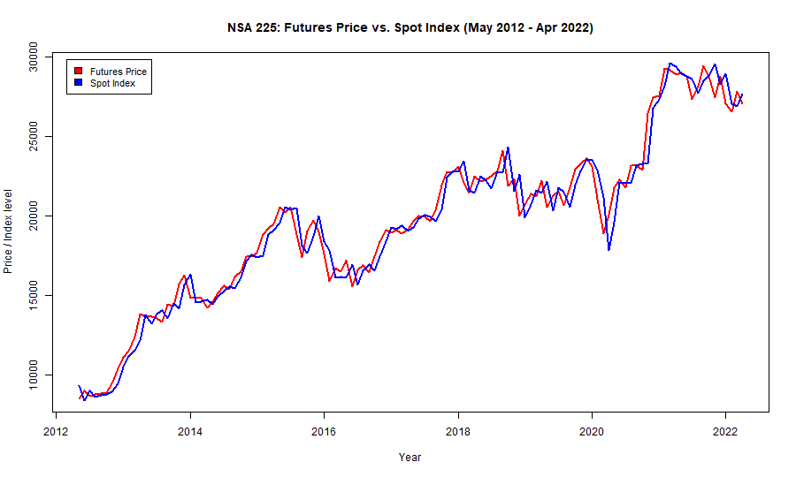
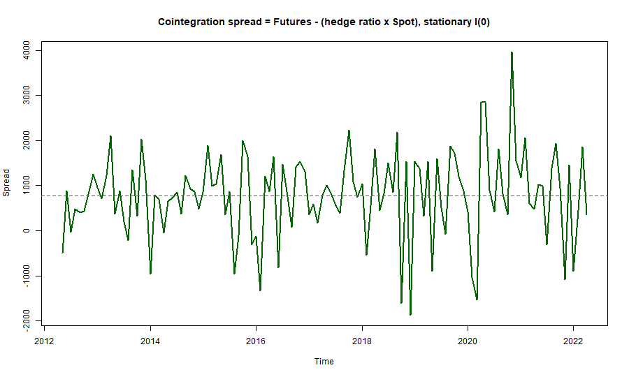
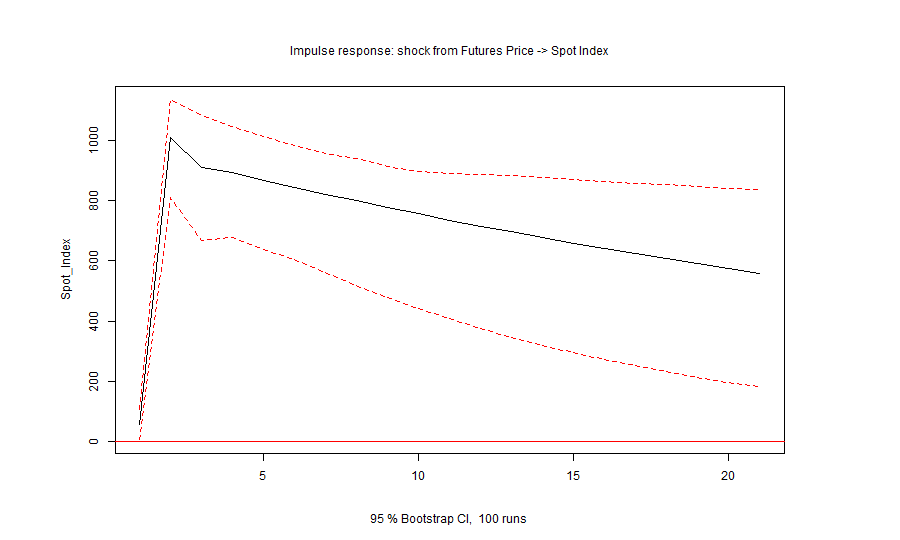
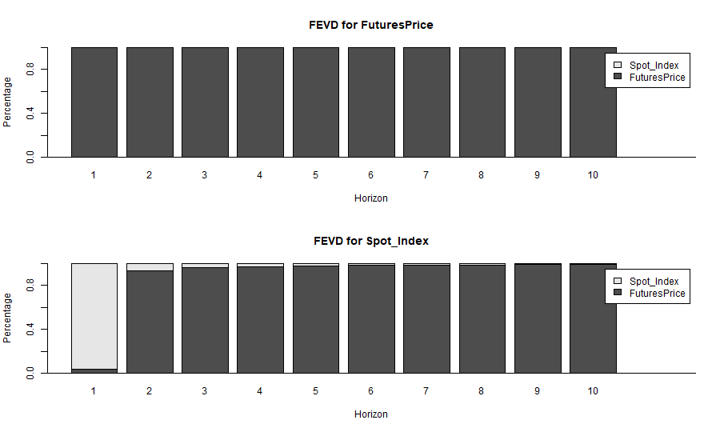
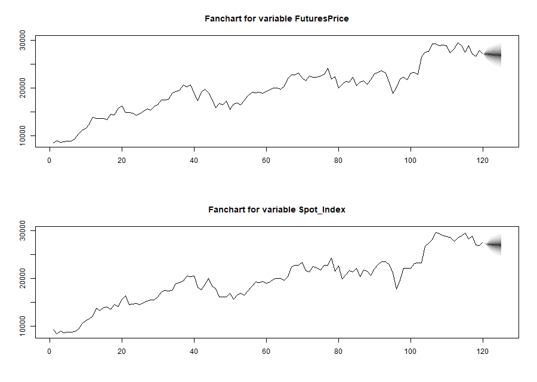

# VAR & Cointegration Analysis of Nikkei 225 Futures and Spot Prices


A time-series econometrics study of the dynamic relationship between the
**Nikkei Stock Average (NSA) 225 Futures Price** and its **Spot Index**, using
**Vector Autoregression (VAR)** and **Engle–Granger cointegration** analysis on
10 years of monthly data (May 2012 – April 2022).

The project answers three questions:

1. Do Futures and Spot prices share a **long-run equilibrium** (cointegration)?
2. Which series **leads** the other (Granger causality)?
3. How does a **shock** to one series propagate to the other, and what do the
   next few months look like (impulse response, variance decomposition,
   forecasting)?

---

## Table of Contents

- [Repository Structure](#repository-structure)
- [Data](#data)
- [Getting Started](#getting-started)
- [Methodology](#methodology)
- [Results](#results)
- [Key Findings](#key-findings)
- [License](#license)

---

## Repository Structure

| File | Description |
|------|-------------|
| [`Cointegration.R`](Cointegration.R) | Engle–Granger cointegration test: ADF stationarity checks, OLS hedge ratio, and spread analysis. |
| [`VAR.R`](VAR.R) | Builds and diagnoses the VAR(1) model; runs Granger causality, impulse response, variance decomposition, and forecasting. |
| [`make_figures.R`](make_figures.R) | Regenerates every figure shown in this README into `figures/`. |
| [`install_packages.R`](install_packages.R) | One-step installer for the required R packages. |
| [`DataFile.csv`](DataFile.csv) | The dataset: monthly Futures Price and Spot Index, 120 observations. |
| [`Report.docx`](Report.docx) | Full written report with methodology, results, and the R code. |
| `figures/` | PNG outputs produced by `make_figures.R`. |

---

## Data

- **Source:** Monthly NSA 225 Futures Price and Spot Index from Investing.com.
- **Period:** May 2012 – April 2022 (120 monthly observations).
- **Columns** in [`DataFile.csv`](DataFile.csv):

| Column | Read into R as | Meaning |
|--------|----------------|---------|
| `Date` | `Date` | Month of the observation (`Mon-YY`). |
| `Future Price` | `Future.Price` | Nikkei 225 Futures price. |
| `Index` | `Index` | Nikkei 225 Spot Index level. |

> The CSV is stored newest-first; the scripts call `rev()` so the analysis runs
> in chronological order, then convert each column to a monthly `ts` object
> starting at `c(2012, 5)`.

---

## Getting Started

### Prerequisites

- [R](https://cran.r-project.org/) **4.2 or newer** (developed on 4.2.0).
- Optionally [RStudio](https://posit.co/download/rstudio-desktop/) for the
  interactive, step-through workflow the scripts are written for.

### 1. Clone the repository

```bash
git clone https://github.com/VinayakMokashi/NSA-225-Var-Cointegration-Analysis.git
cd NSA-225-Var-Cointegration-Analysis
```

### 2. Install the R dependencies

The scripts use `tseries`, `vars`, `forecast`, and `ggplot2`. Install them in
one step:

```bash
Rscript install_packages.R
```

or, from within R / RStudio:

```r
source("install_packages.R")
```

### 3. Run the analysis

Set the working directory to the repository root, then run either script. Each
one loads `DataFile.csv` automatically (no manual file picker needed).

**In RStudio (recommended):** open `Cointegration.R` or `VAR.R` and run it
line by line to inspect each test and plot as it appears.

**From a terminal:**

```bash
Rscript Cointegration.R   # cointegration test and spread analysis
Rscript VAR.R             # VAR model, causality, IRF, FEVD, forecast
```

### 4. (Optional) Regenerate the figures

```bash
Rscript make_figures.R    # writes the PNGs in figures/ used by this README
```

---

## Methodology

1. **Exploratory analysis.** A scatter plot of Futures Price against the Spot
   Index shows a strong positive relationship, motivating joint time-series
   modelling.

2. **Stationarity testing.** The Phillips–Perron and Augmented Dickey–Fuller
   (ADF) tests show both series are **non-stationary in levels** but
   **stationary after first differencing** — i.e. both are integrated of order
   one, **I(1)**.

3. **Cointegration (Engle–Granger).** Because both series are I(1), an OLS
   regression of Futures on Spot gives the **hedge ratio**, and the residual
   **spread** is tested with the ADF test. The spread is **stationary, I(0)**,
   so the two series are **cointegrated** — they share a long-run equilibrium.

4. **VAR model.** `VARselect` chooses a **single lag** (agreed on by AIC, HQ,
   SC, and FPE), so a **VAR(1)** with a constant is estimated. All roots lie
   inside the unit circle (stable), R² exceeds 0.95, residuals show **no serial
   correlation** (Portmanteau test, p > 0.05), and an OLS-CUSUM test shows **no
   structural breaks**.

5. **Policy simulations.**
   - **Granger causality** — Futures price Granger-causes the Spot Index, but
     not the reverse.
   - **Impulse response functions (IRF)** — trace how a shock to one series
     propagates to the other over 20 months.
   - **Forecast error variance decomposition (FEVD)** — measures how much of
     each series' variance is explained by shocks to itself vs. the other.

6. **Forecasting.** The VAR(1) model forecasts both series five months ahead,
   visualized as fancharts with 95% confidence bands.

---

## Results

### Futures Price vs. Spot Index over time

The two series move almost in lockstep and trend upward over the decade — the
visual signature of a non-stationary, cointegrated pair.



### Cointegration spread

The spread (Futures − hedge ratio × Spot) fluctuates around a constant mean
without drifting — it is stationary, **I(0)**, confirming cointegration.



### Impulse response: shock from Futures Price → Spot Index

A one-standard-deviation shock to the Futures price produces a **positive,
persistent** response in the Spot Index; the bootstrap confidence band stays
above zero, so the effect is statistically significant.



### Forecast error variance decomposition

The Futures price variance is driven almost entirely by its own shocks, while a
growing share of the Spot Index variance is explained by **Futures-price
shocks** — reinforcing the direction of causality.



### Five-month-ahead forecast

VAR(1) fancharts for both series, with uncertainty widening over the forecast
horizon.



### Tests at a glance

| Test | Target | Result | Implication |
|------|--------|--------|-------------|
| ADF / PP on levels | Both series | Non-stationary | Trending series |
| ADF on first differences | Both series | Stationary | Each is **I(1)** |
| ADF on spread | Futures − β·Spot | Stationary | Series are **cointegrated** |
| `VARselect` | VAR order | 1 lag | Fit **VAR(1)** |
| Portmanteau | VAR residuals | p > 0.05 | No serial correlation |
| Granger | Futures → Spot | Significant | Futures **leads** Spot |
| Granger | Spot → Futures | Not significant | Spot does not lead Futures |

---

## Key Findings

- **Long-run equilibrium.** Futures and Spot prices are **cointegrated** —
  short-term deviations correct back toward a common trend.
- **Price discovery in the futures market.** Futures prices **Granger-cause**
  the Spot Index but not vice versa: the futures market leads, consistent with
  it being where new information is priced in first.
- **Shock propagation.** Shocks to the Futures price have a significant, lasting
  positive impact on the Spot Index, making Futures a useful leading indicator.

For the complete write-up, see [`Report.docx`](Report.docx).

---

## License

Released under the [MIT License](LICENSE). © 2024 Vinayak Mokashi.
